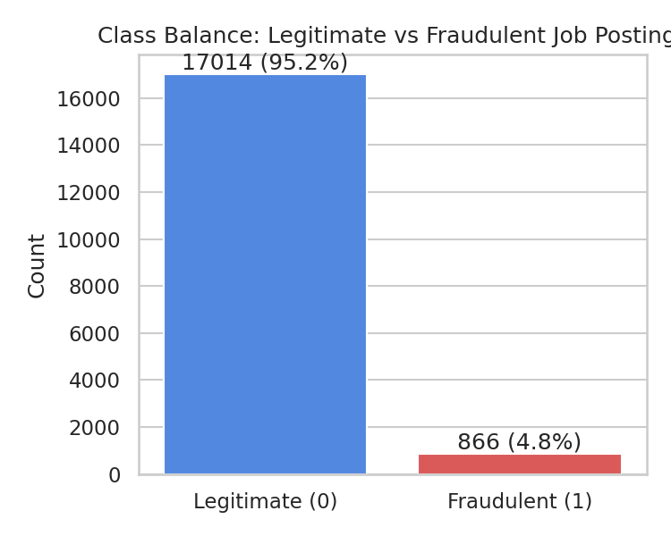
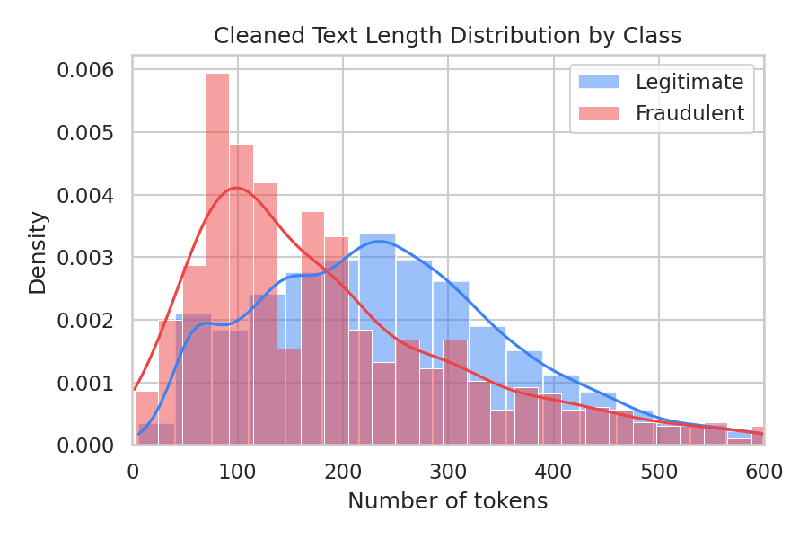
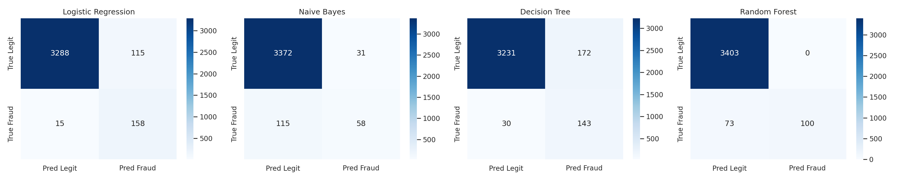
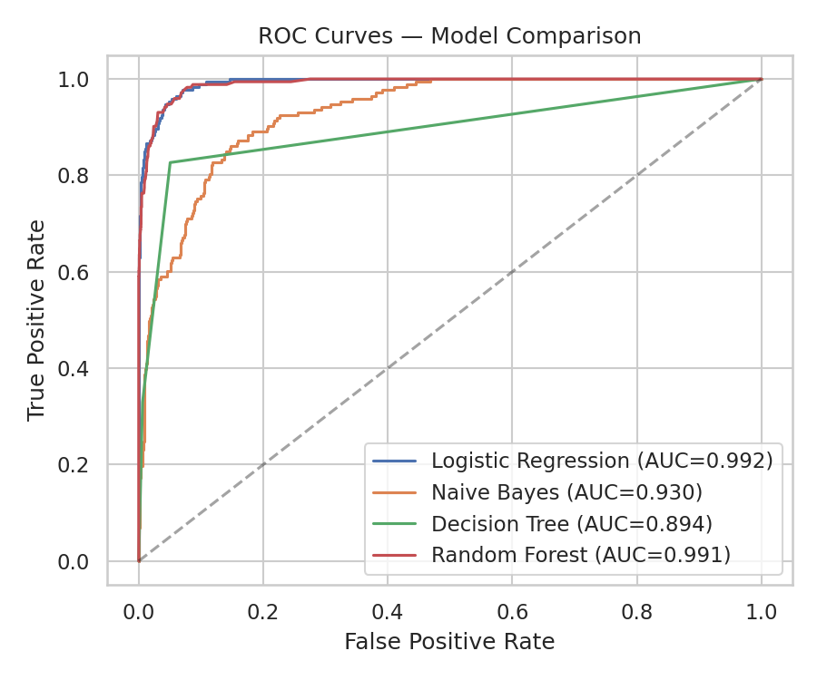

# 🕵️ Fake Job Posting Detection

A machine learning pipeline that identifies fraudulent job postings by combining **NLP on unstructured text** (job description, requirements, company profile, benefits) with **structured meta-features** (telecommuting, company logo presence, screening questions).

Built as part of an internship / job-simulation project. No dataset was provided — the dataset used here is the public **EMSCAD (Employment Scam Aegean Dataset)**, sourced from the ["Real / Fake Job Posting Prediction"](https://www.kaggle.com/datasets/shivamb/real-or-fake-fake-jobposting-prediction) dataset (17,880 postings, ~4.8% fraudulent).

---

## 📁 Project Structure

```
fake_job_posting/
├── data/
│   └── fake_job_postings.csv      # Raw EMSCAD dataset (17,880 rows, 18 cols)
├── src/
│   ├── preprocessing.py           # Text cleaning + feature engineering
│   ├── train.py                   # Trains & compares 4 classifiers, saves artifacts
│   └── predict.py                 # Loads saved model to score new/unseen postings
├── models/                        # Generated by train.py (vectorizer + trained models)
├── reports/                       # Generated by train.py (metrics, plots)
├── app.py                         # Streamlit demo — paste a posting, get a verdict
├── requirements.txt
└── README.md
```

## 🚀 Quickstart

```bash
git clone https://github.com/<your-username>/fake-job-posting-detection.git
cd fake-job-posting-detection
pip install -r requirements.txt

# 1. Train all models (also regenerates reports/ and models/)
python src/train.py

# 2. Classify a single posting from the command line
python src/predict.py \
  --title "Work From Home Data Entry" \
  --description "Earn $500/day, no experience needed, just send your bank details" \
  --requirements "None" --benefits "Daily cash payouts"

# 3. Launch the interactive demo
streamlit run app.py
```

---

## 🔬 Approach

### 1. Exploratory Data Analysis
The dataset is **heavily imbalanced** — only 866 of 17,880 postings (4.8%) are fraudulent — which drives most of the modeling decisions below (stratified splits, `class_weight='balanced'`, and looking past raw accuracy).

| Class balance | Text length by class |
|---|---|
|  |  |

Fraudulent postings tend to skew toward shorter, more generic descriptions and disproportionately lack a company logo or screening questions — patterns the models pick up on.

### 2. Preprocessing (`src/preprocessing.py`)
- Missing text fields (`company_profile`, `benefits`, etc.) are filled with empty strings rather than dropped, since a *missing* company profile is itself a fraud signal.
- The five text fields (`title`, `company_profile`, `description`, `requirements`, `benefits`) are concatenated into one document per posting.
- Text is lowercased, stripped of HTML/URLs/punctuation/numbers, and passed through light stopword removal.
- Structured binary features (`telecommuting`, `has_company_logo`, `has_questions`) are kept as-is and concatenated with the TF-IDF matrix at model time.
- An 80/20 **stratified** train/test split preserves the ~4.8% fraud ratio in both sets.

### 3. Feature Extraction
`TfidfVectorizer(max_features=10000, ngram_range=(1,2), min_df=3, sublinear_tf=True)` — unigrams + bigrams capture short fraud-indicative phrases (e.g. *"no experience"*, *"send bank"*) that single words miss. The sparse TF-IDF matrix is horizontally stacked with the 3 structured columns before being fed to each classifier.

### 4. Models Trained
| Model | Why it's included |
|---|---|
| **Logistic Regression** | Strong, interpretable linear baseline for sparse high-dimensional TF-IDF data |
| **Multinomial Naive Bayes** | Classic, fast text-classification baseline |
| **Decision Tree** | Simple non-linear baseline; sanity-checks whether tree splits add value |
| **Random Forest** | Ensemble of trees; typically strongest on tabular + sparse hybrid features |

### 5. Results (held-out test set, 3,576 postings)

| Model | Accuracy | Precision | Recall | F1-score | ROC-AUC | Train time (s) |
|---|---|---|---|---|---|---|
| **Random Forest** | 0.980 | **1.000** | 0.578 | **0.733** | 0.991 | 34.9 |
| **Logistic Regression** | 0.964 | 0.579 | **0.913** | 0.709 | **0.992** | 0.3 |
| Decision Tree | 0.944 | 0.454 | 0.827 | 0.586 | 0.894 | 6.1 |
| Naive Bayes | 0.959 | 0.652 | 0.335 | 0.443 | 0.930 | 0.01 |




### 6. Comparative Analysis — which model actually wins?

Ranked purely by F1-score, **Random Forest** looks best. But raw ranking hides the real trade-off:

- **Random Forest** has *perfect* precision (every posting it flags as fraud really is fraud) but only catches **58%** of actual fraudulent postings — it's conservative, missing 42% of scams.
- **Logistic Regression** has almost identical ROC-AUC (0.992 vs 0.991) and catches **91%** of fraudulent postings, at the cost of more false alarms (58% precision).

For a real-world screening system, **missing a scam is far more costly than an extra manual review**, so Logistic Regression's recall-heavy behavior is arguably the better production choice despite its lower F1 — the model shipped as `models/best_model.joblib` is selected by F1 for this repo, but `src/train.py` saves *all four* models individually so either can be swapped in `app.py`/`predict.py` by pointing to a different `.joblib` file.

- **Naive Bayes** underperforms on recall — its conditional-independence assumption struggles once bigrams introduce correlated features.
- **Decision Tree** overfits generic patterns without the variance reduction an ensemble provides, landing between the other two extremes.

### 7. Limitations
- The 4.8% fraud rate means even strong models generate meaningful false positives/negatives in absolute terms — this tool should support, not replace, human review.
- TF-IDF has no notion of *semantic* meaning; a sufficiently well-written scam that avoids common fraud phrasing can slip through.
- The dataset is several years old and English-only; fraud language evolves and the model would need periodic retraining on fresh, labeled postings to stay effective.
- Company/industry/location fields were not used as categorical features in this version — a natural next step (see below).

### 8. Possible Extensions
- Add categorical features (`employment_type`, `required_experience`, `industry`) via one-hot/target encoding.
- Try transformer-based embeddings (e.g. DistilBERT) in place of TF-IDF.
- Threshold-tune the chosen model against a business cost matrix (cost of false negative vs. false positive) instead of using the default 0.5 cutoff.
- Add SHAP/LIME explanations to the Streamlit demo so each verdict shows *why* a posting was flagged.

---

## 🖥️ Streamlit Demo
`app.py` provides a simple UI: paste a job posting's fields in, get a **Legitimate / Fraudulent** verdict with a fraud probability, plus a tab showing the full model-comparison table and plots.

## 📊 Dataset Source
Bansal, Shivam. *"[Real Or Fake] Fake Job Posting Prediction."* Kaggle, 2020 — originally the Employment Scam Aegean Dataset (EMSCAD), University of the Aegean.


